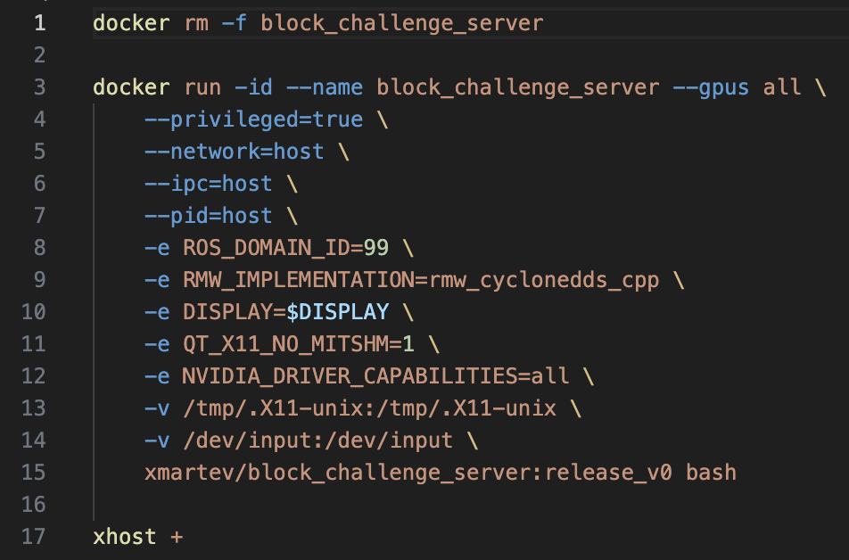

# XMARTEV 机器人控制系统教程

环境依赖：
```
ubuntu >= 20.04
cuda >= 11.8
显存 >= 6GB
空余硬盘空间 >= 80G
```

## server部署指南

### 1. 安装git

打开终端输入
```
sudo apt update
sudo apt install git -y
```
终端输入下面命令git clone到本地
```
GIT_LFS_SKIP_SMUDGE=1 git clone https://github.com/DISCOVER-Robotics/xmartev_block_challenge.git
cd xmartev_block_challenge
```
### 2. 安装docker

若本地尚未安装docker：

```bash
cd xmartev_block_challenge/scripts
bash docker_install.sh
```

验证docker安装：

```bash
docker --version
```

安装参考链接，[docker install](https://docs.docker.com/engine/install/ubuntu/)。

### 3. 安装nvidia driver

推荐使用Software & Updates中Additional Drivers安装，创建镜像和容器前需要检查宿主机的显卡驱动是否正常。

打开终端，输入nvidia-smi检查驱动是否安装成功。
出现显卡信息和驱动版本信息即为安装成功。


### 4.安装 nvidia-docker2

```bash
curl -s -L https://nvidia.github.io/nvidia-docker/gpgkey | sudo apt-key add -
distribution=$(. /etc/os-release;echo $ID$VERSION_ID)
curl -s -L https://nvidia.github.io/nvidia-docker/$distribution/nvidia-docker.list | sudo tee /etc/apt/sources.list.d/nvidia-docker.list
sudo apt-get update
sudo apt-get install nvidia-docker2
sudo systemctl restart docker.service
```

### 5. 注册 dockerhub

注册dockerhub账号：[dockerhub](https://hub.docker.com/) Docker Hub 是一个类似于 GitHub 的平台，只不过它不是存放代码，而是存放 Docker 镜像。选手在client中开发算法，开发完成后打包上传至docker hub，由官方拉取后进行测试。

登录dockerhub账号

```bash
docker login
```

### 6. 从docker hub拉取镜像

```bash
# 从docker hub拉取
docker pull xmartev/block_challenge_server:release_v0

# 如果因为网络问题拉取失败，提供了国内的镜像仓库
docker pull crpi-1pzq998p9m7w0auy.cn-hangzhou.personal.cr.aliyuncs.com/xmartev/block_challenge_server:release_v0

# 查看是否成功获取 xmartev/block_challenge_server 镜像，如果有输出则说明成功拉取到本地
docker images | grep block_challenge_server
```

### 7. Run server container

打开[`scripts/create_container_server.sh`](scripts/create_container_server.sh)并修改镜像 和 tag名称（tag名称以最新的版本为准,如按照上面的版本名tag改为release_v0），如果使用国内镜像源拉取，则需要将第15行的`xmartev/`修改成`crpi-1pzq998p9m7w0auy.cn-hangzhou.personal.cr.aliyuncs.com/xmartev/`



创建server container：

```bash
cd xmartev_block_challenge/scripts
bash create_container_server.sh
```

终端中进入server container：

```bash
cd xmartev_block_challenge/scripts
bash exec_server.sh
```

电脑重启后，需要重新启动容器

```bash
docker start block_challenge_server
```

## Client部署指南
### 1. 拉取client镜像

```bash
# 从镜像仓库拉取
docker pull xmartev/block_challenge_client:release_v0

# 如果因为网络问题拉取失败，提供了国内的镜像仓库
docker pull crpi-1pzq998p9m7w0auy.cn-hangzhou.personal.cr.aliyuncs.com/xmartev/block_challenge_client:release_v0

# 查看是否成功获取 xmartev/block_challenge_client 镜像，如果有输出则说明成功拉取到本地
docker images | grep block_challenge_client
```

### 2. 创建Docker容器

打开[`scripts/create_container_client.sh`](scripts/create_container_client.sh)并修改镜像 和 tag名称，tag`example_tag`需要修改为实际的最新tag,名称以最新的版本为准,如按照上面的版本名tag改为release_v0，如果是从国内镜像源拉取，第15行的`xmartev/`需要修改为国内镜像源名称，例如`crpi-1pzq998p9m7w0auy.cn-hangzhou.personal.cr.aliyuncs.com/xmartev/`


然后执行

```bash
cd xmartev_block_challenge/scripts
bash create_container_client.sh
```

### 3. 进入Docker容器

```bash
cd xmartev_block_challenge/scripts
bash exec_client.sh
```

### 4. 验证ROS2通信

1. 在第一个终端，进入容器并运行发布节点：
   ```bash
   docker exec -it block_challenge_baseline bash
   ros2 run demo_nodes_cpp talker
   ```
   成功运行会看到类似以下输出：
   ```
   [INFO] [1620000000.000000000] [talker]: Publishing: 'Hello World: 1'
   ```

2. 在第二个终端，在宿主机上设置环境变量并运行接收节点：
   ```bash
   # 运行接收节点
   ros2 run demo_nodes_cpp listener
   ```
   通信正常会看到类似以下输出：
   ```
   [INFO] [1620000000.000000000] [listener]: I heard: 'Hello World: 1'
   ```

3. 如通信异常，检查两边的ROS_DOMAIN_ID是否一致：
   ```bash
   echo $ROS_DOMAIN_ID
   ```

## Block Challenge Baseline 使用

### 1. 进入工作目录

```bash
docker exec -it block_challenge_client bash
cd /workspace/block_challenge_client
```

### 2. 运行baseline

> 注意：请提前开启server端服务，并确保ros2话题可以正常传入此baseline容器内

```bash
python3 baseline_round1_seed99.py
```

## ROS2 Topic 含义

```yaml
Subscribed topics:
 * /clock [rosgraph_msgs/msg/Clock] 1 subscriber
	# 仿真时钟
 * /airbot_play/arm_camera/aligned_depth_to_color/image_raw [sensor_msgs/msg/Image] 1 subscriber
 	# airbotplay机械臂环境深度相机 内参
 * /airbot_play/arm_camera/color/image_raw [sensor_msgs/msg/Image] 1 subscriber
 	# airbotplay机械臂环境rgb相机的rgb图像，编码格式rgb8
 * /airbot_play/side_camera/aligned_depth_to_color/image_raw [sensor_msgs/msg/Image] 1 subscriber
 	# airbotplay机械臂相机 内参
 * /airbot_play/side_camera/color/image_raw [sensor_msgs/msg/Image] 1 subscriber
 	# airbotplay机械臂相机的rgb图像，编码格式rgb8
 * /airbot_play/joint_states [sensor_msgs/msg/JointState] 1 subscriber
 	# airbotplay机械臂全身关节状态量，顺序为 joint_names: [
    # - arm_joint1
    # - arm_joint2
    # - arm_joint3
    # - arm_joint4
    # - arm_joint5
    # - arm_joint6
    # - arm_eef_gripper_joint
    # -]

Published topics:
 * /arm_forward_position_controller/commands [std_msgs/msg/Float64MultiArray] 1 publisher
 	# 控制mmk2手臂移动
 * /yolo/detections [yolov8_msgs/msg/Detections] 1 publisher
 	# yolo检测结果
 * /yolo/result_image [sensor_msgs/msg/Image] 1 publisher
 	# yolo检测结果可视化图像
```

关于baseline进一步的说明，请参考[baseline说明](doc/baseline.md)。

## 常见问题(FAQ)

1. 运行baseline时出现特定错误提示，提示需要启动server端
   - 解决方案：请确保已正确启动对应的server端服务，再重新运行baseline程序

2. ROS2通信失败
   - 检查宿主机和容器内的`ROS_DOMAIN_ID`是否一致
   - 确认已正确安装并配置`rmw_cyclonedds_cpp`中间件
   - 检查网络连接和防火墙设置

## 完成开发后上传client镜像

选手在client中开发算法，开发完成后打包上传至docker hub，由官方拉取后进行测试，测试使用电脑配置为：

```
cpu : 13th Gen Intel Core i7 13700KF x24
gpu : GeForce RTX 4090 24G
Memory : 64GB
```

### 1. 新建private repo

参赛队伍在自己注册的dockerhub上新建一个private repo，名字为xmartev


### 2. 将client镜像push到private repo
先登录：


```
docker login -u <dockerhub_name>
```

给本地已有镜像打 tag, (tag名称，参赛队伍可以自定义)，client_name是本地已有的镜像名，client_tag是它的标签，dockerhub_name为dockerhub的账号名字
可以先用下面命令查看本地client_name是否存在:

```
docker images | grep client_name
```
```
docker tag client_name:client_tag dockerhub_name/xmartev:tagname 
```
在以下示例中，dockerhub_name为`zeyu1999`


将新tag的client镜像push到private repo
```
docker push dockerhub_name/xmartev:tagname 
```


### 3. 开发比赛任务

根据private repo和tag名字，修改create_container_client.sh里的镜像名和tag,这里第三航的block_challenge_client是container_name


运行create_client.sh，创建新容器。

运行exec_client.sh脚本，进入客户端镜像终端开始进行开发工作。

强烈推荐使用 Git 工具进行代码版本管理，以确保代码的安全性和可追溯性。

在 Docker 环境中，您也可以通过 Visual Studio Code（VS Code）安装docker插件 进行高效开发。

### 4. docker commit（使用 docker commit 保存容器内修改）


本地保存镜像修改内容，使用原有的tag会覆盖之前tag版本的内容，如这里我们的container_id为block_challenge_client, dockerhub_name为自己docker hub的名字。
可以终端输入docker ps来查看container id
```
docker ps
```
```
docker commit container_id dockerhub_name/xmartev:new_tag
```


### 5. docker push（推送新镜像）

通过docker push到private repo保存当前docker镜像到dockerhub
```
docker push dockerhub_name/xmartev:new_tag
```


### 6. 生成访问 Token（用于评测拉取）

参考连接：[docker token](https://docs.docker.com/docker-hub/access-tokens/)

>   非常重要：在需要提交测试的版本时，选手需要将自己的dockerhub用户名、docker token 和 镜像的tag由比赛系统提交。以下为生成docker token的指南。
>


